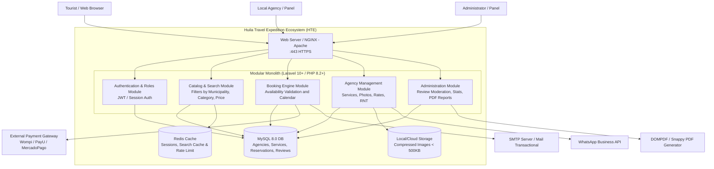

# System Architecture Overview: Huila Travel Expedition 

## 1. Adopted Architectural Style
 **Style:** Modular Monolith with Hexagonal Architecture (Laravel 10+) transitioning to REST API Services.
 
 **Justification:** Given the initial scale of the project for the Huila department, the infrastructure resources (shared hosting: 1 vCPU, 1 GB RAM in the first phase, scalable to VPS), and the development team, a Modular Monolith architecture with clean code (Clean Architecture / Hexagonal) in Laravel offers the best cost-benefit ratio, maintainability, and delivery speed. It allows for the decoupling of domains (Agencies, Tourists, Reservations, Administration) through independent modules with their own delimited context, leaving the structure ready to extract microservices or independent services in the future without rewriting the business logic. 
 
 **ADR Reference:** ADR-001-architectural-style.md

## 2. C4 Diagram — System Level (Context)

Shows how the Huila Travel Expedition ecosystem relates to external users and third-party services/systems.

```text
┌────────────────────────────────────────────────────────────────────────────────────────┐
│                        Huila Travel Expedition System (HTE)                            │
│                                                                                        │
│  ┌───────────────────────────┐  ┌───────────────────────────┐  ┌────────────────────┐  │
│  │    Tourists Module /      │  │    Agencies Module /      │  │    Admin Module /  │  │
│  │    Catalog & Tour Search  │  │    Services & Offer Mgt.  │  │ Moderation & Stats │  │
│  └─────────────┬─────────────┘  └─────────────┬─────────────┘  └─────────┬──────────┘  │
│                │                              │                          │             │
│                └──────────────────────────────┼──────────────────────────┘             │
│                                               │                                        │
└───────────────────────────────────────────────┼────────────────────────────────────────┘
                                                │
                 ┌──────────────────────────────┴──────────────────────────────┐
                 │                                                             │
        ┌────────▼──────────────┐                                    ┌─────────▼─────────────┐
        │   External Services   │                                    │    Users / Actors     │
        │ - Payment Gateways    │                                    │ - Tourists (Nat/Int)  │
        │ - WhatsApp Bus. API   │                                    │ - Local Agencies      │
        │ - Transactional SMTP  │                                    │ - HTE Administrator   │
        └───────────────────────┘                                    └───────────────────────┘
```
## 3. C4 Diagram — Container Level

 Shows the main processes, databases, and communication channels of the HTE platform.


## 4. Service Catalog (Internal Modules)

| # | Module / Service | Responsibility | Subsystem / Context | Database / Storage | Communication Type |
----|------------------|----------------|---------------------|--------------------|--------------------|
1 | `auth-module` | Authentication, registration with RNT validation, RBAC (Admin, Agency, Tourist) | Administration / Core | MySQL (`users`, `roles`, `agencies`) | HTTP REST / Encrypted Session
2 | `catalog-module` | Search, filtering by municipality/price/duration, featured plans | Tourists | MySQL + Redis (Cache) | REST API / Blade Views
3 | `booking-module` | Booking engine, calendar date verification, ACID transactions | Tourists / Agencies[cite: 3] | MySQL (`bookings`, `schedules`) | REST API / Events (Sync/Async) |
4 | `agency-module` | CRUD operations for tour packages, image upload/compression (<500KB),  | Agencies | MySQL (`services`, `rates`) + Storage | REST API / Multi-part Forms |
5 | `review-module` | Rating (1-5 stars), experience reviews, manual moderation | Tourists / Admin | MySQL (`reviews`) | REST API |
| 6 | `reporting-module` | Generating dashboard statistics and exporting PDF reports| Administration / Agencies | MySQL (Queries) + DOMPDF | REST / Binary Stream (PDF) |
| 7 | `notification-module` | Automatically sending confirmation emails and WhatsApp alerts | Cross-functional | SMTP Server / WhatsApp API | Async Queues (Laravel Queue) |

## 5. Architectural Principles

**P1: API-First & Mobile-First Design**
The entire interface for tourists and agencies is designed with a *Mobile-First* approach (responsive from 320px) and the logic is exposed using clean contracts (JSON / REST API) to facilitate multi-terminal support and future mobile applications.

**P2: Transactional Integrity of Reservations (Zero Overbooking)**
The booking engine guarantees secure concurrency through transactional locks (ACID) in the MySQL 8.0 database, ensuring that a fully booked slot or date in the availability calendar does not suffer from overbooking.

**P3: Automatic Resource Optimization** All multimedia files uploaded by agencies (destination images) are compressed in the background to ensure they do not exceed 500 KB per file, protecting storage capacity and ensuring reduced loading times.

**P4: Regulatory Compliance and Security by Design (Habeas Data & SSL)**[cite: 3] The processing of personal data requires explicit consent with a timestamp (Law 1581)[cite: 3]. Communication is 100% HTTPS, and passwords are processed using Laravel's native secure hashing scheme (`bcrypt`).

**P5: Scalable Modularity (Isolated Migration to VPS)**[cite: 3] The system is developed in Laravel 10+ and structured in domain-isolated modules[cite: 3]. It initially runs on shared hosting (1 vCPU, 1 GB RAM) and allows migration to a dedicated VPS environment in less than 8 hours of technical work without modifying the codebase.

## 6. Adopted architectural patterns

| Pattern | Adopted | Reference |
|---------|---------|-----------|
| Modular Monolith | Yes | `05-architecture/decisions/ADR-001-architectural-style.md` |
| Hexagonal Architecture | Yes | `05-architecture/hexagonal-architecture.md` |
| Repository Pattern | Yes | `05-architecture/pattern-guide.md` |
| Data Transfer Objects (DTO) | Yes | `05-architecture/pattern-guide.md` |
| Circuit Breaker / Fallback| Yes | `05-architecture/decisions/ADR-002-resilience-policy.md` |
| Outbox / Async Queues | Yes | `05-architecture/decisions/ADR-003-async-notifications.md` |
| CQRS | No (review in v2.0 | Evaluated for future high-concurrency scaling |

## 7. Cross-cutting concerns
Transversal concerns that apply to ALL modules:

| Concern | Adopted solution | Where it is configured |
| --- | --- | --- |
| Authentication / Authorization | Laravel Middleware + RBAC (Spatie: Admin, Agency, Tourist) | `app/Http/Middleware/` & Policies |
| Input Validation | Form Requests with structured Spanish JSON/HTML errors | `app/Http/Requests/` |
| Error Handling | Standard Exception Handler with standard HTTP status codes | `app/Exceptions/Handler.php` |
| Image Compression | Automatic background compression (< 500 KB / WebP) | `app/Services/ImageService.php` |
| PDF Generation | DOMPDF binary stream generation | `app/Services/ReportService.php` |
| Security & Encryption | SSL HTTPS redirection + `bcrypt` password hashing | `AppServiceProvider.php` & Web Server Config |
| Logging & Audit | Monolog JSON format + Terms acceptance log (Habeas Data) | `config/logging.php` & `audit_logs` table |
| Rate Limiting | Laravel Throttle Middleware (Login & Booking endpoints) | `app/Providers/RouteServiceProvider.php` |

## 8. Registered architectural technical debt

| ID | Description | Impact | Priority | Target sprint |
| --- | --- | --- | --- | --- |
| AT-001 | Manual inventory synchronization (Lack of external Channel Manager) | Medium | P2 | Sprint 5 (Phase 2) |
| AT-002 | Manual verification process of agency RNT numbers by Admin | Low | P3 | Sprint 4 |
| AT-003 | Basic payment gateway integration without advanced Webhooks | Medium | P2 | Sprint 3 |

## 9. Planned evolution

| Version | Architectural change | Motivation | Estimated date |
| --- | --- | --- | --- |
| v1.0 | Laravel Modular Monolith on Shared Hosting | Initial MVP launch to unify Huila tourism offer | Q2 2026 |
| v1.5 | Infrastructure migration to Dedicated VPS (2 vCPU, 4 GB RAM) | Handle peak season traffic (> 50 concurrent users) | Q4 2026 |
| v2.0 | Full REST API + Channel Manager & Native Mobile Apps | Sync with OTAs (Booking/Airbnb) and iOS/Android apps | Q2 2027 |

## Key correlations
- Domain bounded contexts → `02-domain/domain-map.md`
- Specific decision ADRs → `05-architecture/decisions/`
- Hexagonal architecture per module → `05-architecture/hexagonal-architecture.md`
- Applied patterns → `05-architecture/pattern-guide.md`
- Service & module catalog detail → `09-microservices/service-catalog.md`
- UML & C4 diagrams → `08-uml/`
